# **Blender Add-on - Match Rotate! (v1.0)**

Match Rotate is a free add-on for Blender that makes your workflow a little easier. With this simple addon, you'll be able to rotate any number of selected objects to the exact orientation of the active (last selected) object in the 3D Viewport. 

You can also do this along a chosen axis, as well as randomly rotate all selected objects, regardless of scale or position. This is useful for anyone looking to improve their workflow, or simply wanting a little bit more control over objects in scenes. 

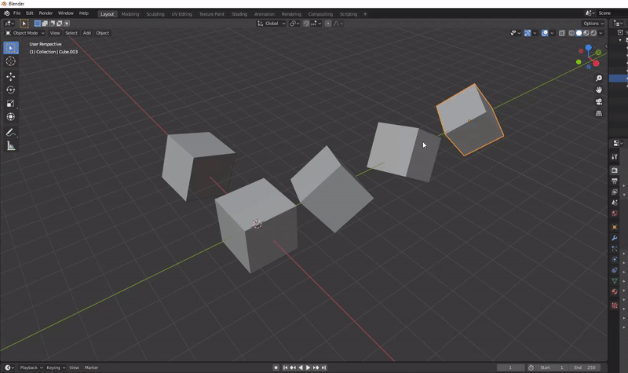

Match Rotate is an open-source, lightweight, and simple add-on that requires nothing special to use or install! 

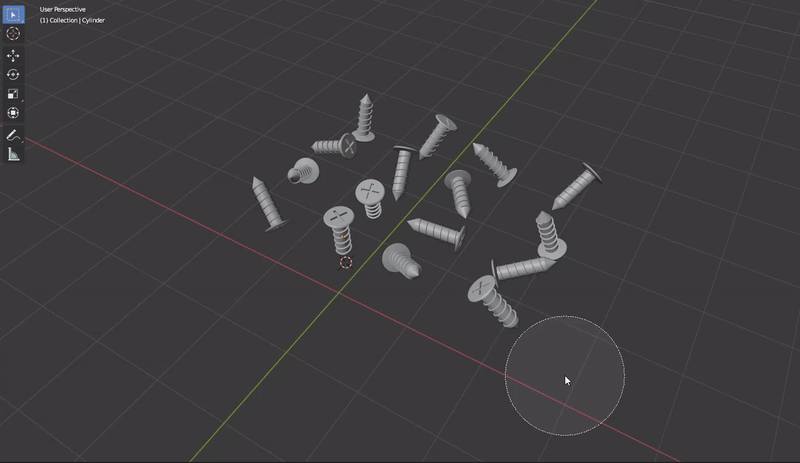

\**Note - even though for these examples the active objects are being rotated to (0,0,0) and are on a flat plane, this add-on works regardless of the active object's rotation in Object Mode, and selected objects' position and scale*
  
---
## *Table of Contents*
   * [Feature List](#feature-list)
   * [Compatibility](#compatibility)
   * [Installation](#installation)
   * [Usage](#usage)
   * [Feedback/FAQ](#feedback-faq)
     * [Known Limitations](#known-limitations)
   * [Changelog](#changelog)
---
# **Feature List** 
**Version 1.0 Feature List:** 
- Rotate selected objects to the exact same orientation as active (most-recently selected) object
- Choose which axis to align the rotations to (active object's X, Y, and/or Z)
- Choose between rotation of all objects or exclusively meshes (useful if you select and entire collection and don't want to rotate certain objects like lights/cameras)
- Random rotation, with control over variance, set by degrees. This allows for objects to be similar to or slightly off the rotation of the active object 

# **Compatibility**
Match Rotate is currently designed to work with Blender 2.83. Other versions, including later and older, are still in the process of being tested, but should work fine, given the simplicity of this addon.

 Please report any issues you may have with newer/older versions. 

# **Installation**
**This add-on can be installed into Blender like any other third party add-on.** 

If you are totally new to installing add-ons, I recommend looking at [the official Blender Wiki page for Addons](https://docs.blender.org/manual/en/latest/editors/preferences/addons.html) under "third party Add-ons" before you start. 

For those who have never installed a third party addon, or are still new, here's a short step-by-step guide on how to install: 

1. Download the zipped folder from above (or clone this repo)
2. Place the zipped folder in a path where you have placed add-ons before, or where you would like to install (something like: `C:\Blender\Addons\[zipped folder here]`). 
3. Open Blender
4. At the top left, go to `Edit -> Preferences` to open the Preferences Menu
5. Click the `Add-ons` tab on the left 
6. From here, click the `Install...` button: 

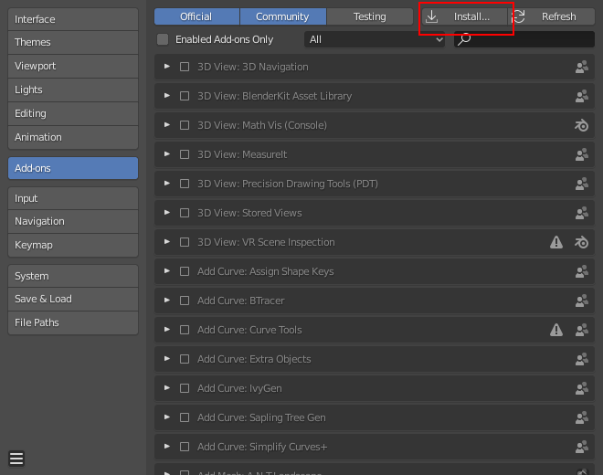

1. This will open up the file explorer. Navigate to where you previously stored the zipped folder (should be called `MatchRotate_v1.zip`, or similar)
2. Click the `Install Add-on` button once you've selected the zip file, like so: 
   
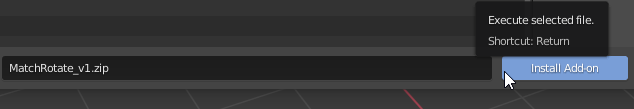

## Enabling the Add-on: 

1. Once installed, you should now see the addon in the file explorer. (If you do not, hit `Refresh`). You can search for it using the search bar by typing "Match". Should be called `Object: Match Rotate`: 
    
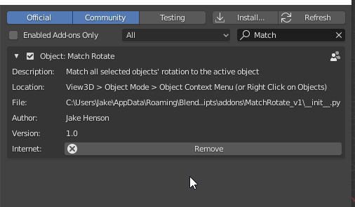

2. As with any other Add-on, click the checkbox on the upper-left side to enable it

3. You can now close the Preferences window and enjoy! 

# **Usage** 
*What does Match Rotate do?* Exactly what it sounds like - matches rotation! Specifically, it is used in the 3D viewport to match the rotation of all selected objects to active object's orientation, matching it. You choose whether this occurs to X, Y, and Z axes. There are several other features which we can use. While this guide is a tad long, the actual addon is super simple and easy to use. 

To start, I've created Blender scene with several objects rotated at different directions, like so:
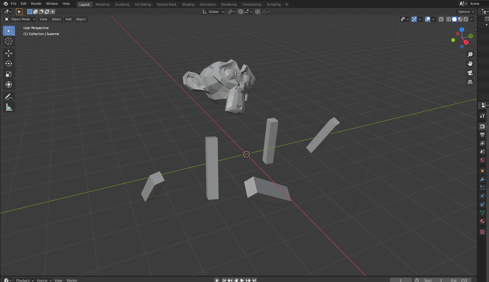

To start, make sure you are in **Object Mode** 

Select multiple objects, and select the object you want to match the rotation of **last** (the active object).

**Make sure you have multiple objects selected with 1 active object in the scene**. In my example scene, I've selected Suzanne (the monkey head) as my active object, and the rectangular cubes as my selected objects I want to rotate: 

- If you are new to Blender, to select multiple objects, you can: 
  - Hold `shift` and right-click the objects you want. The last one you click will be the active one
  - Press `C` to open up the circle selection tool and drag your mouse across the object (You may have to `shift` + right click to select the active object if it doesn't show up)
  - Select an entire collection by right clicking it in the scene menu and left-click `Select Objects` (Again, you may have to `shift` + right click to select the active object if it doesn't show up)

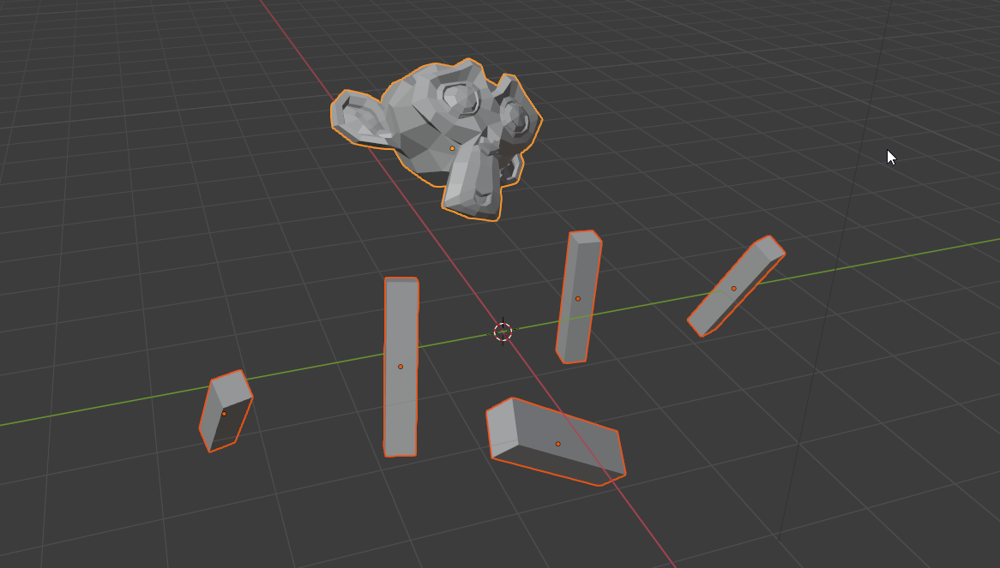

From here, there are *two* ways to activate. **With the objects still selected**, you can either: 
- **Right-click** to bring up the Object Context Menu and select `Match Rotate` at the bottom
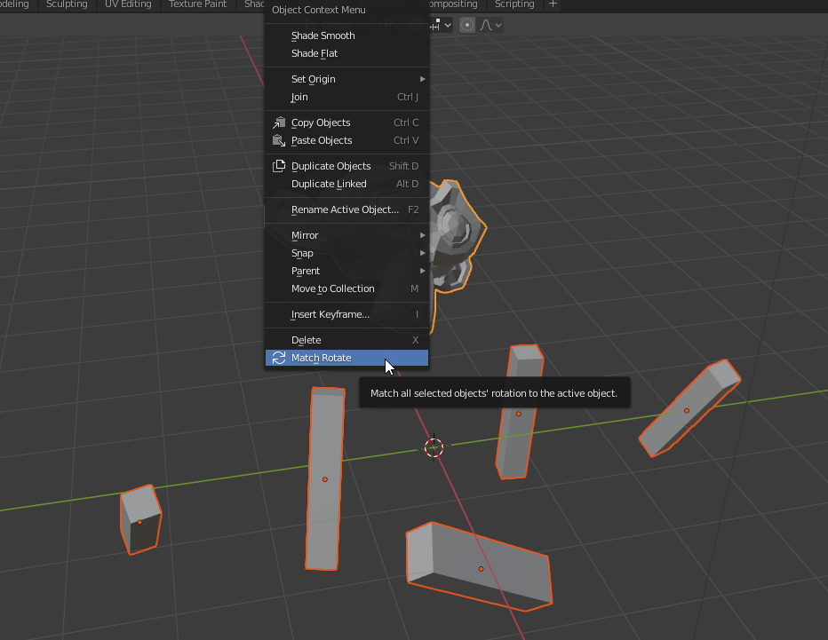

- *OR* press `F3` to bring up the Search menu and search for `Match Rotate`, and click it
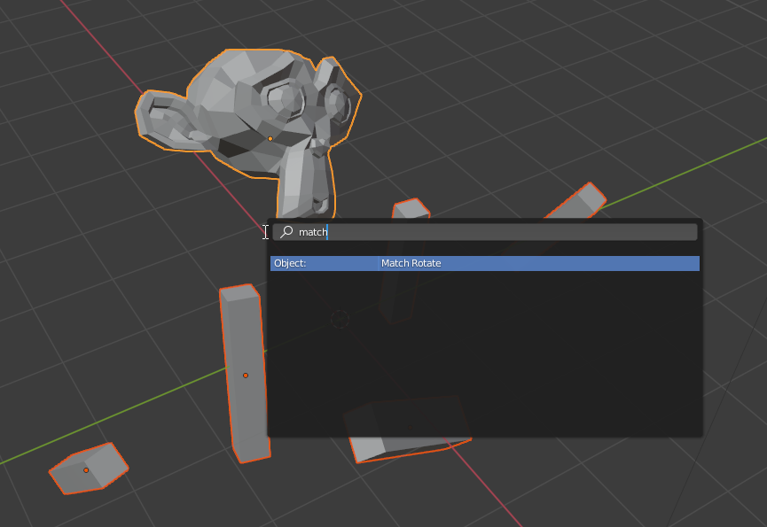

*Voilà!* The selected objects will have matched the active object's rotation!

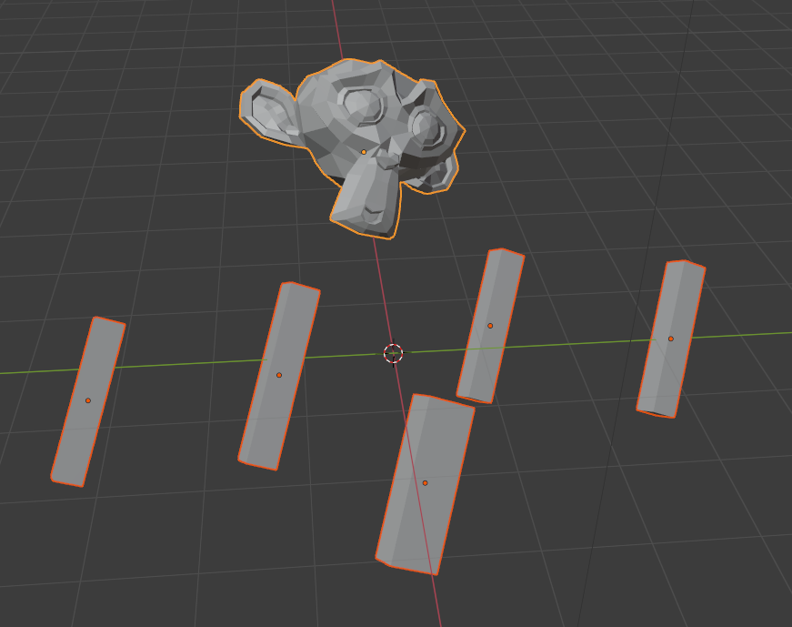

This is the primary feature of the addon, however, you have some features you can play with if you'd like to get more specific. If you open up the Match Rotate window in the bottom-left of the viewport, you will notice several parameters: 

 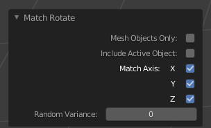

- `Mesh Objects Only` - By default, this is off. If selected, it will *only* rotate mesh objects and exclude objects such as lights, cameras, or emptys. This is especially useful when selecting entire collections. 
 - `Include Active Object` - By default, this is off. If selected, it will rotate the active object along with the selected. This is only visible if you are adjusting random variance, since the active object's rotation is already getting matched anyway. 
 - `Match Axis (X, Y, Z)` -  By default, all of these are selected. When selected, each will match the selected object's corresponding axis' rotation. For example, if you only want to match the Z axis, uncheck X and Y.  
 - `Random Variance` - By default, this is set to 0&deg;, and can go up to 360&deg;. 
   - Leave this at 0 to match the rotation of the active object
   - If adjusted, it will randomly rotate all of the objects in the scene, within a range of the set positive and negative degree value. (i.e., changing this to 10 will rotate all of the selected objects in the scene some range between -10&deg; and +10&deg; of the active object's respective rotation) 

Here is an example of what you can do using Random Variance and setting the Match Axis to Z: 

 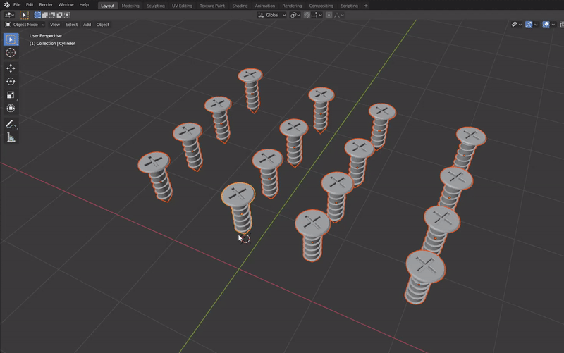

Note that in this case I checked `Include Active Object` since I wanted my active screw object to be rotated randomly along with all the other ones

# **Feedback/FAQ**
## FAQ
**Q: I can't see the Match Rotate icon when I right click!**
- **A:**  First, double check you're in Object Mode. This addon *only* works in object mode. If you are still not seeing it, try searching using `F3`. Make sure you have the addon installed correctly 
  
**Q: My objects aren't rotating correctly in my scene!**
- **A:** Check that your objects' orientation and rotation is/are set how you want when editing. If an object's mesh is sideways/rotated odd in Edit Mode, but it's rotation is set to `(0,0,0)` in Object Mode, it will be rotated with respect to the Object Mode's rotation. To fix this, in Edit Mode, select all and rotate your mesh how you want. 

  - Also, double check that the `Random Variance` is set to 0. By default, it's set to 0, but if changed, it will stay that way. Also make sure that all of the `Match Axis X`, `Y`, and `Z` are checked. 

**Q: I used an array modifier to make several objects, now I can't rotate them with this addon!**
- **A:** Array modifiers bind copies of objects to the objects themselves, and are as such treated as a single object in Object mode. Because this addon is designed to rotate multiple objects, it doesn't work correctly. However, [there are ways of separating array objects](https://blender.stackexchange.com/questions/109/how-can-i-use-an-array-modifier-to-create-individually-manipulatable-objects)
  
**Q: Will Match Rotate ever be in the Community Releases?**
- **A:** Maybe. I still need a lot of feedback and testing, and I am currently looking into getting it there there. I'm a very busy college student so I don't have loads of free time to actively keep it up to date with each new Blender versions, though. I'm hoping to work on it and test it as often as I can though, and refine it more in the future.  

**Q: Can I edit/change/build-on this addon?**
- **A:** Go for it! Yes! As stated by the GPL license, you may add on, expand upon, edit, transform this to your liking. I have zero commercial or financial interest in this add-on it is merely designed for fun and productivity. This Add-on is and always will be free and open-source. Although I respectfully ask that you do not sell this exact code for profit and/or claim it as your own.
  
--

## **Known Limitations**
- This is addon is limited to only working with Object Mode orientations/rotations. Note that if you have already applied rotation in Object Mode to all your objects in different orientations (`ctrl` + `A`; Apply Rotation) then this may cause this addon not to work as intended. Meshes which are rotated odd in edit more

- It may not work well with animation rigs/posed characters, or particle systems. It is primarily designed for rotating a large amount of objects + meshes. 
  
- You may not get the desired effect of matching if you have a lot of modifiers, such as an array, applied to your objects.  

- `Random Variance` parameter can be a little too random, and can sometimes be indistinguishable at high values. I'm currently working on some more fine-tuning fixes and I'll have those up soon. 

--

## Feedback
Got a bug to report? Feature suggestion? Do let me know by contacting me through Github; raise an issue. I will do my best to keep this addon up to date and fix any bugs. As mentioned earlier though, I'm a very busy college student so I may not get to these issues right away. 

# **Changelog**
- 8/11/2020 - **(v1.0)** First initial commit, version 1.0 made public 